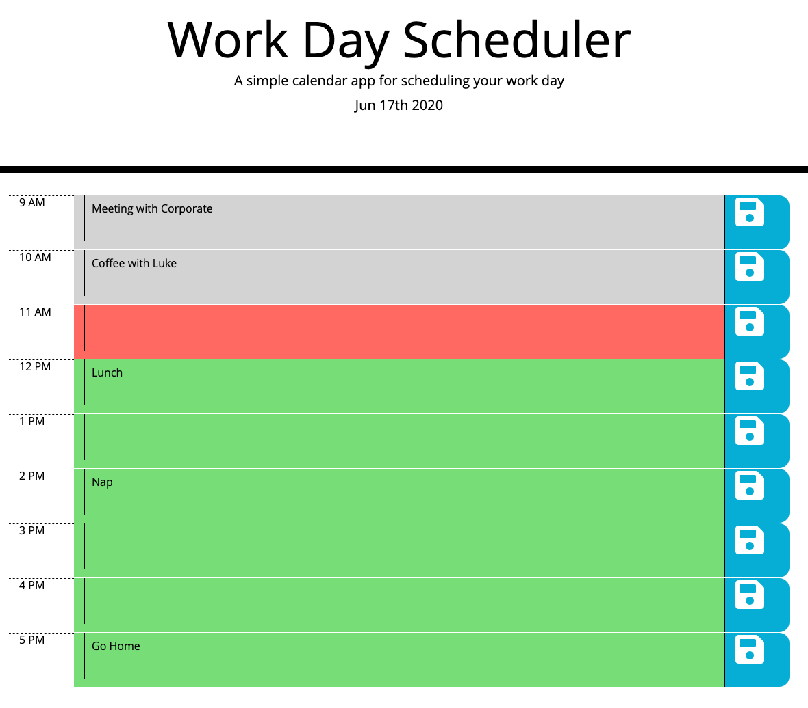

# Work Day Scheduler

This is a simple page that allows you to schedule your workday (between 9AM and 5PM) by saving tasks in each 1hr block.  The page also colour codes whether a time block has passed, is currently active or is still in the future.  This page makes use of local storage to save the tasks for each hour.

Deployed application: https://mbesemann.github.io/Assignment-5-Work-Day-Scheduler/

